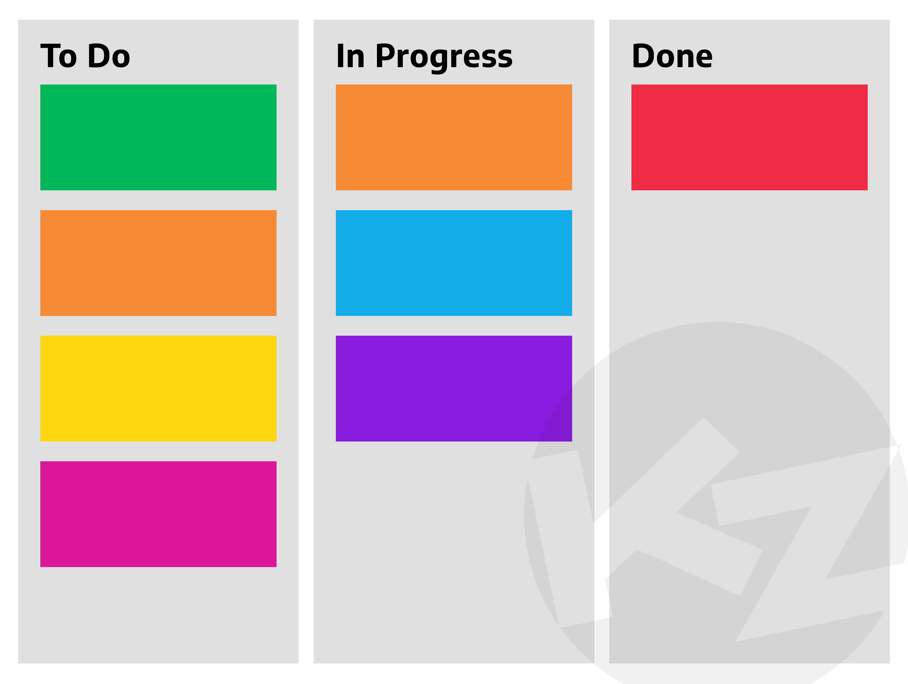
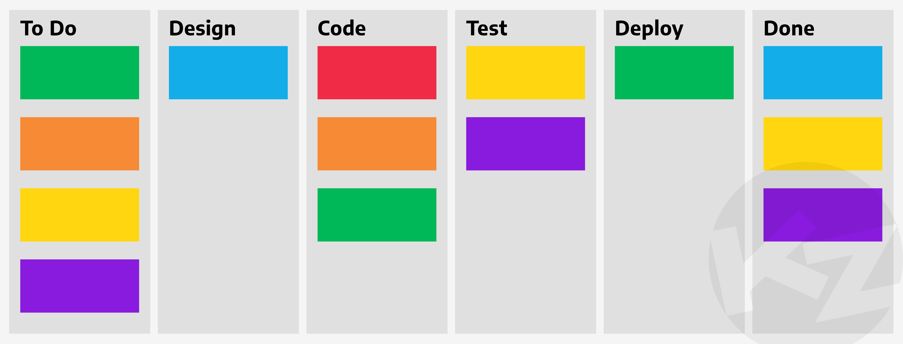

# Project Management
The goal of project management is to make it easier to understand the work that needs to be done, track the progress of individual work items, to reduce the communications overhead, and to increase productivity of all involved.
By applying project management strategies to your work you can expect to get more work done with your limited resources, have a clearer view of the current state of your projects, and be able to collaborate with others more effectively.

## Has this happened to you before?
- You attend a meeting to discuss a result that a colleague has been working on. They have emailed the figure to the group so they ask if everyone is looking at it. One person can't find the email so they share the screen so everyone can see the email attachment. They then realise that this is not the most up to date version of the figure so they spend a minute finding the latest figure on their laptop.

- You attend a meeting to discuss a project your group is collaborating on. This involves updating the group on the progress of the tasks which takes most of the meeting. Only one of the tasks requires discussion so it feels like an inefficient meeting.

- You complete a task and want to move to a new task but you're not sure what tasks still need doing or if anyone is already working on them.

The above examples are quite common in academic life, and are a sign that a project is not engaging in effective project management strategies.

## Common problems and how to solve them through project and data management
The following are some problems you may have experienced in your research that make your work inefficient, along with some potential solutions:
1. Struggling to find the email with the attached plot you are looking for
    - Have a central place where all plots are kept

2. Not being sure if this is the most up to date version of a plot
    - Every time an update to a plot is made, you upload the latest version to a shared location and comment on the differences

3. Struggling to keep track of your task
    - Track all of your tasks and sub-tasks using a visualisation tool such as a Kanban board

4. Forgetting deadlines
    - Add deadlines to all your tasks, and use a task tracking tool that will show reminders for upcoming deadlines

5. Not budgeting your time (spreading yourself too thin) so you can't work on your project
    - For each project you work on, budget a fraction of your time you plan to spend on it, and once you commit all your time, do not take on new projects

6. Struggling to keep track of who was assigned to a task
    - Use a work tracking app like Trello, to assign people to tasks and track their progress

7. Unsure who is assigned to the task that is blocking you
    - You can see on Trello who is blocking your task and send them a note to ask when they expect to complete the task

8. Having meetings that involve updates on tasks rather than helpful discussions
    - Use a work tracking app with a Kanban board so that you can see the status of all tasks at a glance. You do not need to talk about the progress of all tasks, just those that are causing problems or are being delayed. Your meetings can be focused on solving problems.

## Your life after discovering project management
<!-- Probably not the best name but I was blanking -->

- You attend a meeting to discuss a result that a colleague has been working on. Everyone has access to where you stored the plot and can see every version of it and your comments on the changes. You can discuss the most recent change and even discuss reverting to a previous version if you made the plot more difficult to understand.

- You attend a meeting to discuss a project your group is collaborating on. Since the status of all tasks are displayed on your project management app there is no need to spend the meeting updating the group on the progress of the tasks. The meeting only involves discussion of difficult problems. The meeting feels very productive even though it took much less than the alloted 1 hour.

- You want to start on a new task so you select a task on the project management app, assign yourself and mark it as in progress so the group knows you have started the task.

# Project management frameworks
There are several project management strategies, such as waterfall and agile, which have a particular mentality for approaching a project and their own areas of strength.

The [agile](https://www.atlassian.com/agile) project management strategy is a well defined project management framework that is different from the fairly ad-hoc or free style approach that is typically used in academia.
The agile approach aims to deliver a minimum viable product as soon as possible, and then gradually expand the scope of the project to include additional features as time and resources allow.
Requirements, plans, and results are continuously reviewed, so that agile is able to quickly and easily respond to change.

The [waterfall](https://asana.com/resources/waterfall-project-management-methodology) project management methodology divides a project into distinct phases, and each phase into a series of tasks.
The tasks and phases are scoped, resourced, and ordered to produce a Gantt chart, with each task having a set of precedents that must be complete before the task can be begun.
A waterfall project typically does not produce any usable results until the entire project is complete.
Since the requirements, plans, and resources are all agreed upon at the start of the project, it is difficult for the waterfall process to respond to change (think of that institution-wide project that took years to complete an was obsolete as soon as it was finished).
Whilst the waterfall methodology is poorly suited to a research environment, projects which require a high degree of compliance are well served by a waterfall project management strategy.

## Visual task tracking with a Kanban board

A common tool that many project management strategies use is a Kanban board.
Kanban boards are one of the most common ways to keep track of your tasks and can simply track tasks as "To Do", "In Progress", and "Done".
Tasks will be created in the "To Do" category, then migrate into "In Progress" when someone picks them up to begin work, and then move into the "Done" category when completed.

Tasks can be created at any time and may enter the Kanban board at the "In Progress" stage (or as "Done").
Many apps which offer Kanban boards will also allow tasks to be grouped into "Epics" or "Milestones" so that you can track progress towards project deliverables.

The number and names of the columns can be changed to suit your needs. Here is an example of a software development Kanban board with six columns representing the development cycle of features.

Having an online Kanban board will help your colleagues see what the status of your tasks are and you can upload all version of the figure in one place and get instant feedback without the need for a meeting.

## What tools can we use?
In this course we will show you how to use [Trello](https://trello.com/en) and [GitHub](https://github.com/) to more efficiently collaborate with your colleagues and manage your projects.
There are other tools (such as [Jira](https://www.atlassian.com/software/jira), [GitHub Projects](https://docs.github.com/en/issues/trying-out-the-new-projects-experience/about-projects) and [GitLab](https://about.gitlab.com/)) that may better suit your projects and we encourage you to try in the future.
Once you learn how to use Trello and Github it will be easy to pick up these other tools.
We will learn about Trello in the next lesson.



