# Trello
Trello is one of the most popular project management applications thanks to it being easy to use, flexible, and free.
In this lesson we'll take you through the process of setting up a new Trello account, creating a workspace and board, and generating an example set of tasks.

If you have not already, create a Trello account [here](https://trello.com/).

## Trello basics

Trello organizes your tasks by workspaces and boards.
Tasks that relate to a project are grouped into the same boards, and then multiple related boards are grouped into a workspace.
For example you may have a different board for each of your research projects, but then group them together based on your collaborations.
If you are doing a PhD then you'll probably just need a single board for your PhD, and a single workspace to hold that board.
As an early career researcher you'll probably have a workspace that is something like "my astro work", which then has a different board for each of the projects that you are involved in.
Many people find it useful to also have a "personal" or "home life" board that they use to track non-work related activities.

Trello uses a Kanban board to track tasks for each of your boards, and this is the default visualization that you'll see when you create a board.
The different columns within a board are referred to as "lists" and items within the list are "cards".
You will have the freedom to create/rename/delete the lists as you see fit, and to move cards between lists as they move through the to-do/doing/done phases that you define.

Now that we have that nomenclature out of the way, lets get started with our Trello accounts.

## Making your first workspace and board
When you first make a Trello account, you will see this screen.

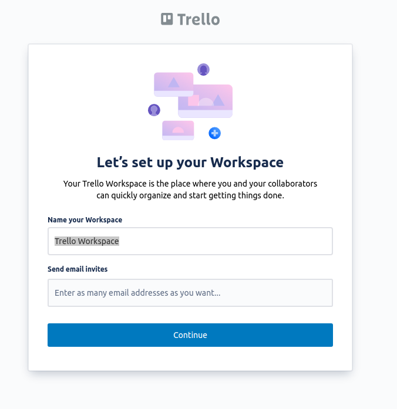

Recall that a Workspace as a collection of boards (or projects).
We recommend that you name your first Workspace "Personal" (you can change this later).
Click continue and then skip the free trial.

You can then click "Create your first board" and name it something related to your work, like "Research".
Remember that a board as a place where you will manage a single large project (E.g. your PhD, a paper or an enormous processing task).
There are several useful templates, but for now, we will show you how to make one from scratch.

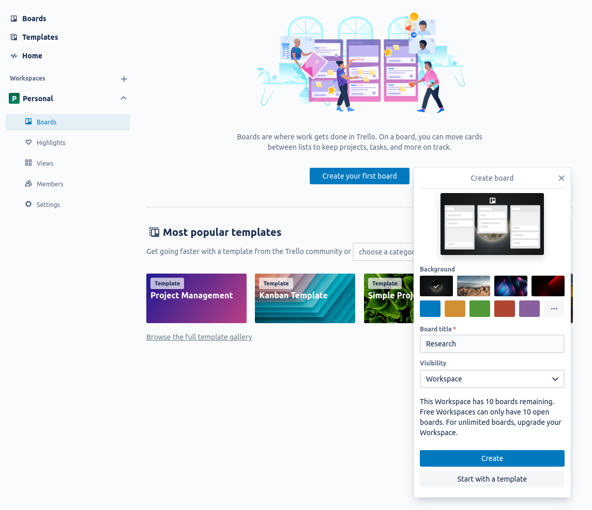

## Project Plan
Once you have made the project Trello board, the first thing you should do is fill in the description (or a card) with your project plan.
This project plan is what will help you keep track of the intent, scope, and timeline of your project, as well as the people and resources that you'll have access to.
You can add a description by pressing "Show Menu" (top right) and clicking on the description.
A project plan will help you set a clear goal and ensure you immediately consider things like documentation and data storage.
Once the project is complete you can reflect on your project plan to find ways you can improve.

The following is our recommended project plan template.
Depending on the project, some items will be more important than others but it is still important to consider all items.

~~~
Title

Description:

Estimated completion date:

Collaborators:
# Name, Role, Affiliation, FTE, Email
- @Jocelyn (link to account), Project Lead, CIC, 0.5, jocelyn@gmail.com

Goals:

Requirements:
E.g. Supercomputing or telescope time

Risk and mitigation measures:

Software:

Documentation:

Data storage (Eg. google drive folder):

~~~
{: .language-MD}

This project plan is for your internal reference, and it should assist your communication and data management.

### Title and description
These can be kept brief and should be used to quickly introduce a new collaborator to what we plan to do and include any relevant plots.

### Estimated completion date
In research, there are rarely hard deadlines for project completion, but it is still helpful to estimate how long (or how much effort) a task will be complete so researchers can budget their time.

### Collaborators
Stating all the collaborators and their roles will clarify who holds which responsibilities from the beginning.
The Full-Time Equivalent (FTE) has two purposes; it will give the project lead an idea of how much work they can assign and for the collaborators' reference to track how much time they have already committed before accepting new projects.

### Goals
When deciding on the next steps, you should consider the project's goals to ensure that you are not doing work outside the project's scope.
These goals can be brief and straightforward (e.g. publish a paper and process some data) and used to keep the project on track.
You should consider the impact and work required for each goal to ensure it is worth the effort.
If your goals change midway through the project, it is essential to re-assess the project plan.

### Requirements
There are likely supercomputing or telescope requirements for your project.
It is important to state these early on to plan proposals and estimate when you will get processed data.

### Risks and mitigation measures
If your proposals are not accepted, are there other telescopes or supercomputers you can use?
Will you back up your data in case the supercomputer crashes and you lose it?
A quick consideration of the risks and what you can do to mitigate them can save you a lot of pain down the road

### Software
If you're developing software as part of this project, you should include the GitHub repository link.
If there is software that you depend on or are adapting, it is useful to have those links here.
Where possible, you should version control your software within your groups' GitHub organisation.
It is also important to consider how this software will be used in the future and adapt good coding practices from the beginning.

### Documentation
Here, you can link the documentation you're developing or any other helpful documentation.
Deciding on what documentation is required will make it easier to develop as you go.
It is much more difficult to create documentation at the end of the project when you have forgotten some of your processing decisions.

### Data storage
The best method of data storage is very project dependent.
Deciding where to store the data initially will make it easier to share data with collaborators during the project.
How to access the data should be described here, which could be a link to cloud storage or the directory on a supercomputer.
E.g. Google drive, R drive or CloudStor and who has access.

## Creating cards
It is helpful to think of each Trello card as a single task (even if that task has several steps).
To create a new card, click "Add a card" on one of your lists.
Give the card a simple title.
You can then click on the card and give it a description.

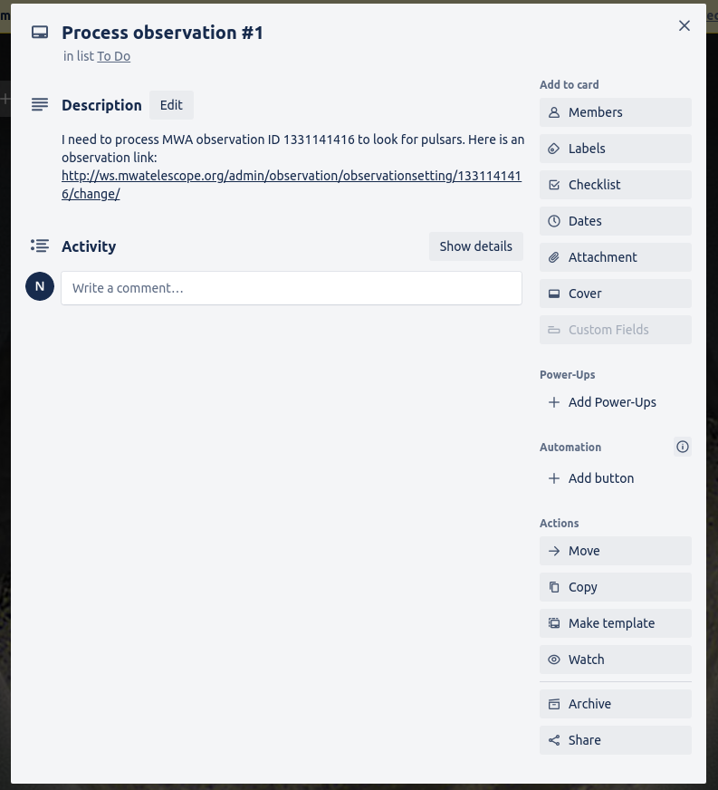

You can then add to the card so it contains more information
- Members: You can assign users to cards so you can easily see who is working on the task.
- Labels: The labels are customizable, so you can use them in any way that you find useful. You can label your cards into types of tasks (Eg. processing, writing, researching) or urgency, for example.
- Checklist: You can use checklists to track which steps you have completed.
- Dates: You can set a due date and set yourself due to date reminders.
- Attachments: You can attach any type of file. You can attach files in the comments so you can explain what changes you've made to the image and have a record of all image versions.
- Comment: You can use comments to keep notes of what you've done and even commands you've run and their output

Here is an example of what the card could look like

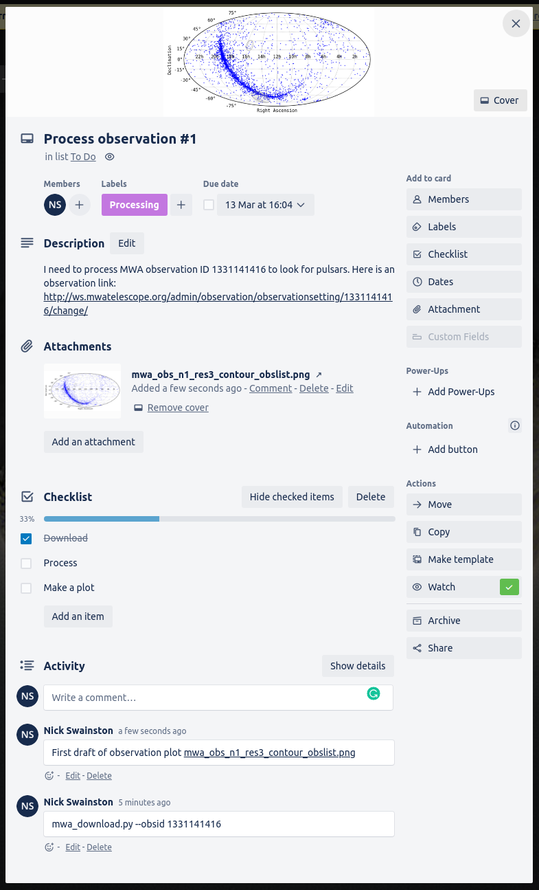

## Making card templates
Card templates are useful as reminders of what information to include or save yourself time when you know you will be making many similar cards.

Here is an example of a simple template
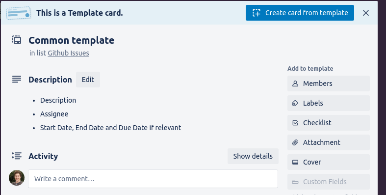
I created this template by filling in the description and clicking "Make template" at the bottom right of the card. You can now make new cards from this template and use the text as a reminder of what you should include.

Templates are also useful for keeping track of processing steps. Here is an example of a processing template that will remind you of the data to record and has a checklist to help me keep track of which step you are on.
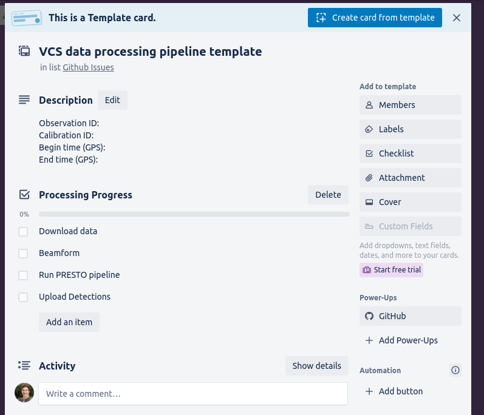

## Creating research group workspaces
You can make a Trello workspace for your research group that will allow all workspace users to access all of the Trello boards within the workspace. You can create a new workspace by clicking Trello and then the new workspace button.

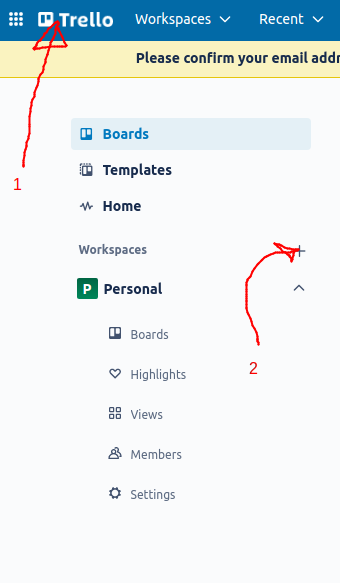

You can then name your workspace whatever you wish.

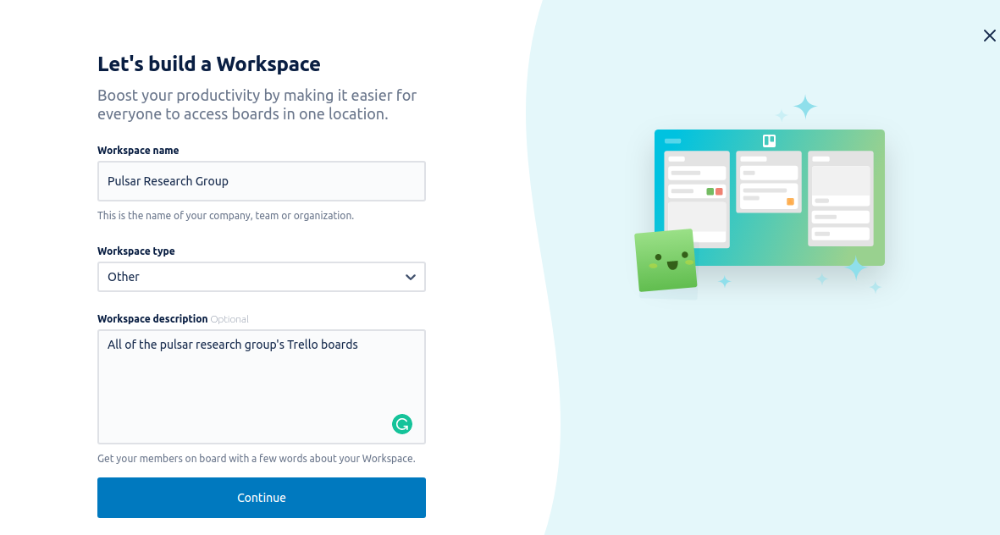

Then add members by sending them an email invite.

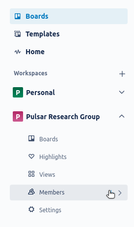

You can then create a board for every large project you have. All members of your workspace will have access to these boards.

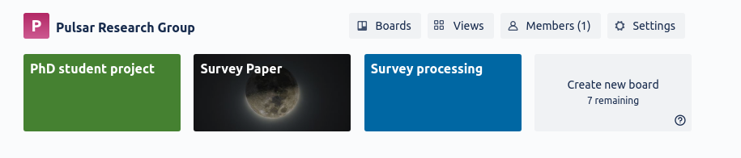

Recommendations on how to use these boards effectively will be covered in the [following episodes](../07-paper_collaboration)

### Private boards
By default, all workspace members have access to the boards in the said workspace. If you have private data that you are not ready to share with everyone in your group, you can switch your board to private.

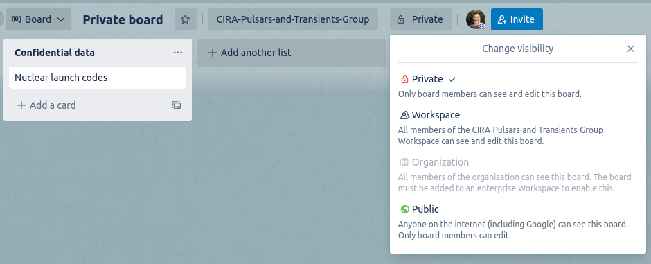

You can also keep it in your personal workspace and move it to the group workspace when you are ready to share the results.

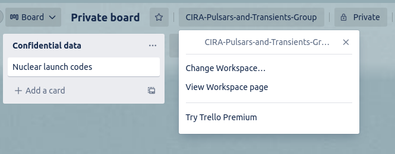

# Summary
In this lesson we learned about Trello workspaces, lists, and cards, and how to use Trello to create a Kanban style project management space.

In the next lesson you'll learn how to use project management for your personal benefit before expanding this to group project management.



