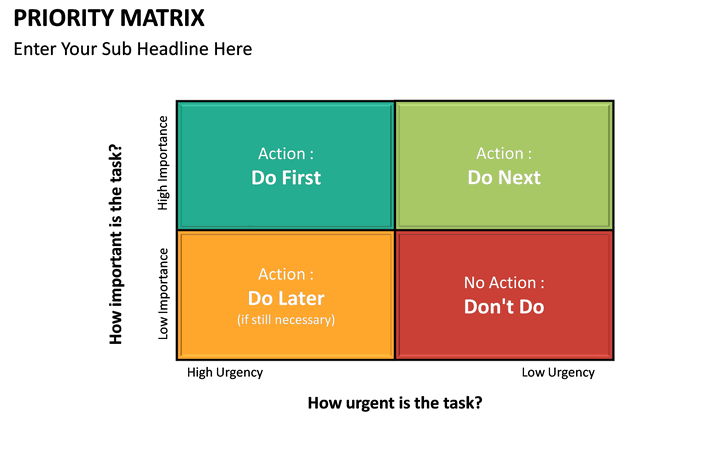
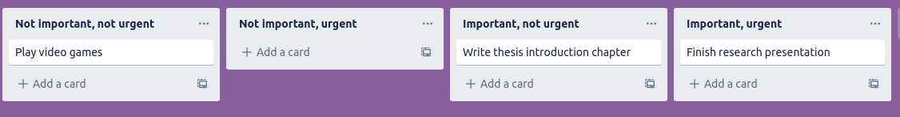
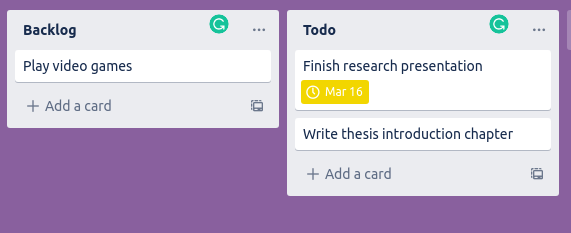
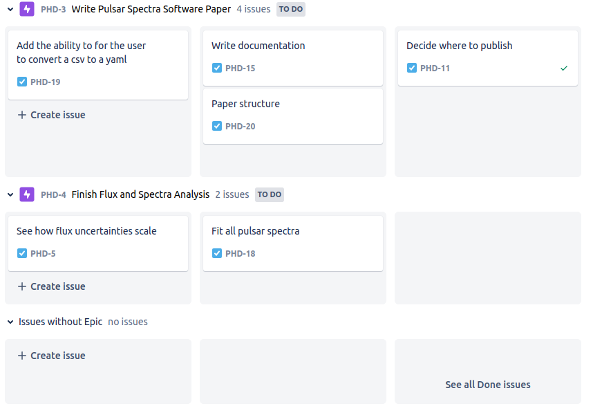
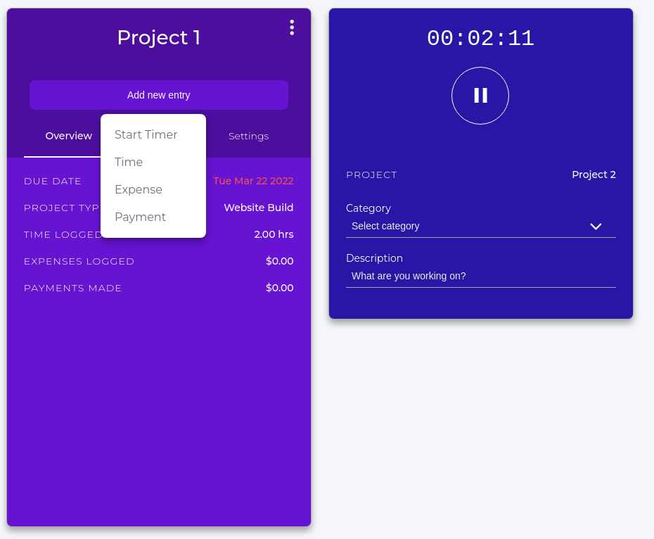
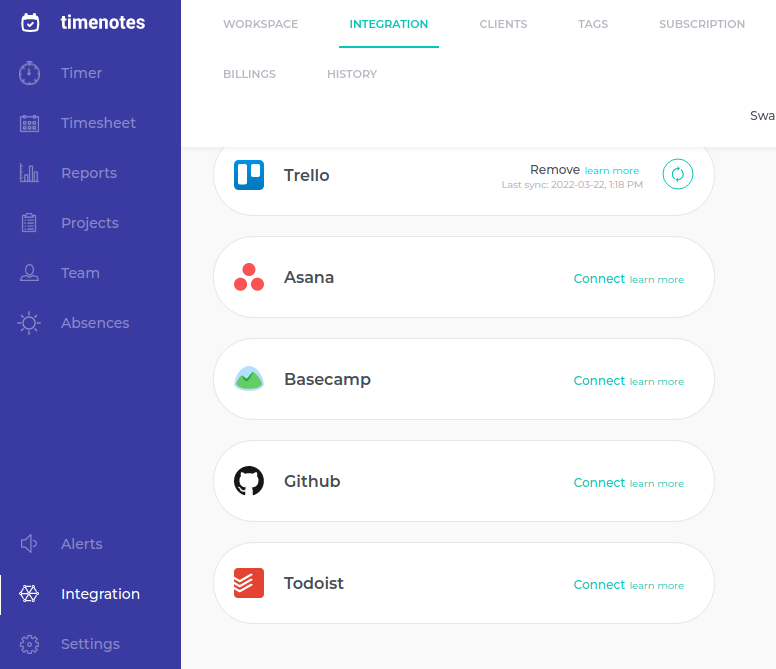
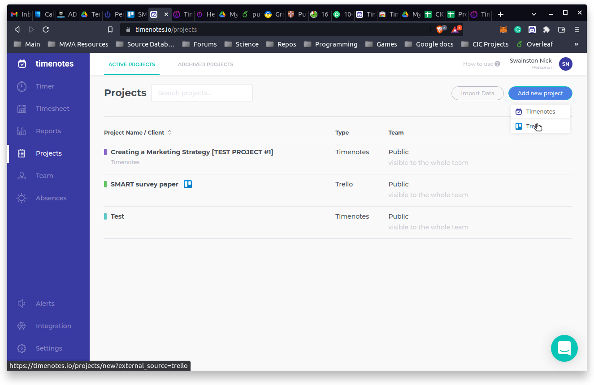
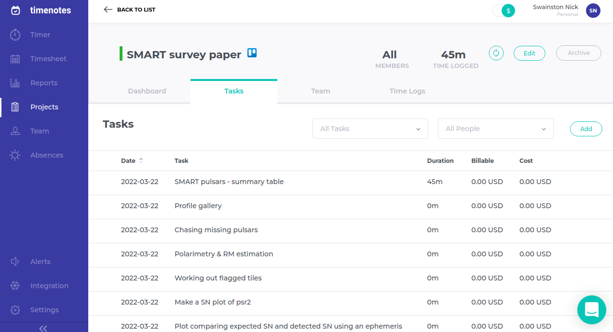
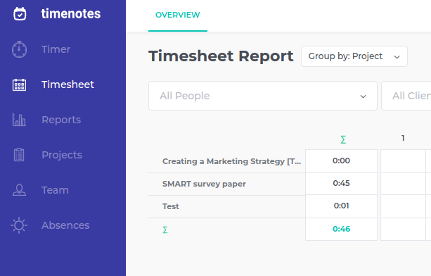

# Personal Project Management

## Task Management
When you have a large number of tasks on your plate it can be overwhelming to try to mentally keeping track of them. Noting your tasks in an app will free your mind from trying to keep track and will allow you to visualise you tasks.

## Task Prioritisation
A common metric to decide on the order to do tasks is the priority matrix:

You can decide if each task is important important and if it is urgent and then perform the tasks in the order
1. Important, urgent
2. Important, not urgent
3. Not important, urgent
4. Not important, not urgent

You can display this in Trello in two main ways, using a list for each of part of the priority matrix or by using a list for urgent and not urgent and adding due dates to cards.

### Four list method
Here is an example of how you can make a list for each of part of the priority matrix.

You should work from right to left as you decide which task to work on. It is important with this method to regularly review the cards and move them as they become urgent.

### Two list method
You may also find it useful to split your "To Do" list into "Backlog" and "To Do" or "To Do" and "To Do Important" to help yourself prioritise important tasks. When possible, you should always give your cards/tasks a due date. This will allow you to see what tasks are urgent with the help of Trello. Trello displays a yellow clock for due the next day and a red clock for overdue. Here is an example:

You can see that the "Finish research presentation" is due tomorrow so you should complete that first. You can also use Filter (top right) and only displays items that are due within a certain time range.

> ## Bonus note
> As you become more familiar with Trello, you may want to try something more advanced like Jira. One benefit is that you can organise your tasks into different "epics" (you can think of epics as projects) so that you can see your progress in different epics. Here is an example
> 
> If you're interested here is a [Jira Fundamentals course](https://university.atlassian.com/student/collection/850385/path/1083901)
{: .callout}

## Time management
To ensure that you are not spread too thin and you can finish tasks on time, it is essential to decide what fraction of your time, also known as Full-Time Equivalent (FTE), you want to allocate to each project you are working on. It may also help you to use a time tracking app. If you are spending more than 10 minutes tracking your time, it is unlikely to be worth the effort, so we will describe some simple time tracking methods. This basic information will allow you to see how much time tasks and projects take and improve your future estimates.

### Excel method
[Here](https://docs.google.com/spreadsheets/d/1SGGcZE7vZULR72iWkuvSsmgca2sCJEu9CWxWDEVF2L0/edit?usp=sharing) is a link to a simple Google Sheets template of an easy way to track how much time you spend per week on several projects. Simply update it at the end of the week with what fraction of your time you spent on each project.

### Chronos app
[Chronos](https://app.chronostimetracking.com/) Is a simple app that will allow you to keep track of your project time. Simply make a new project with a descriptive name and set the billing type to non-billable. You can start a timer for the project you are currently working on or manually add how many hours you have spent.

### Timenotes app
[Timenotes](https://timenotes.io/) is another option if you want a bit more detail and to be able to integrate with Trello. Once you've made an account, you can sync it to your Trello account.

You can then add a Trello board as a Timenotes project.

This will allow you to log time for individual tasks (Trello cards)

And then, on the Timesheet page, you can group the times by Project and see how much time you spend on each project.



