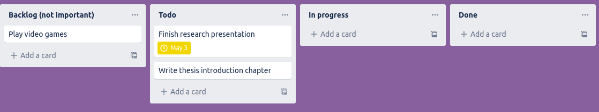

# Personal Project Management

## Task Management
When you have a large number of tasks on your plate it can be overwhelming to try to mentally keep track of them.
Noting your tasks in an app will free your mind from trying to keep track and will allow you to visualize you tasks.

## Task Prioritisation
In most cases you will have more tasks than time available to do said tasks.
You will therefore need some way of determining which tasks should be done and which can be left undone or done at a later time.
A common metric to decide on the order to do tasks is the priority matrix:

Once you decide on the importance and urgency of all your tasks you can perform them in the following order:
1. Important, urgent
2. Important, not urgent
3. Not important, urgent
4. Not important, not urgent

You can display this in Trello in two main ways, using a list for each of part of the priority matrix or by using a list for urgent and not urgent and adding due dates to cards.

### Priority focused
Instead of using Trello as a Kanban board, you can rename your lists to be the four priority categories from above.
Cards (tasks) will likely stay within a single category for their life cycle (though maybe they move from non-urget to urgent).
Here is an example of how you can make a list for each of part of the priority matrix.

In this scheme, you should work from right to left as you decide which task to work on.
It is important with this method to regularly review the cards and move them as they become urgent.

### Kanban style
If you wish to keep your Kanban board style but incorporate task priority, you can do this by using a due date to show the urgency of a task and show the importance of a task by either using labels or separate lists.
This will allow you to see what tasks are urgent with the help of Trello.

Below is an example of using two lists to separate your tasks by priority. The backlog list can include your not important tasks (or stretch goals) that will likely only be completed when you have no more Todo items.

You can also use labels to separate tasks by priority if you prefer. In the example below, we used a pink label for important tasks and black for unimportant ones. Remember that you can use the Filter button to only show important tasks if you'd like.

You can see that the "Finish research presentation" is due tomorrow, so you should complete that first. It should be noted that Trello only displays a yellow clock for due the next day and a red clock for overdue.
You can also use Filter (top right) and only display items that are due within a certain time range.

> ## Bonus note
> As you become more familiar with Trello, you may want to try something more advanced like Jira. One benefit is that you can organise your tasks into different "epics" (you can think of epics as projects) so that you can see your progress in different epics. Here is an example
> 
> If you're interested here is a [Jira Fundamentals course](https://university.atlassian.com/student/collection/850385/path/1083901)
{: .callout}

### Alternate task metric
Instead of thinking of your priority matrix in terms of importance and urgency, you can instead use impact (research output) and effort (time spent working).
This is useful when considering which projects to take on and their goals.
Successful researchers are often skilled at choosing projects that are high impact with minimal effort.

## Time management
An essential part of organizing the work that you need to do involves estimating the amount of time or effort that is required for each task.
This estimation can be difficult to get right, but you can make the process easier by using a data driven approach - tracking the time spent on activities and then using that to inform your future estimates.
Time management and time tracking can therefore be central to properly managing your projects.

A common way of tracking/estimating time is to work in hours/days/weeks/months of effort.
However you are often not working on a single task at a time so it can be easier to break your total time available (your Full-Time Equivalent or FTE), into fractions, and then assign these fractions to different tasks.
By estimating and tracking your FTE over the course of a project you can ensure that you are not spread too thin and you can finish tasks on time.
Effective time management will prevent you from taking on more work than you can realistically complete.

For example, someone asks you to help with a project.
You look at your project planning app and see that you have two projects you aim to spend 0.4 FTE on and a third you aim to spend 0.2 FTE on.
Since this fills up the entire 1.0 FTE, you let them know that you can not assist on their project.
You know that your third project will be complete in a month, so you offer to provide help at the level of 0.2 FTE starting in a month.

Deciding where you spend your FTE is only half the battle.
You must also track your time to ensure that you are staying on budget, and adjusting if required.
Tracking your time can be done through several apps ([see the following section](#time-tracking-apps)) and should give you at least a rough estimate of the time you spend on each project.
This basic information will allow you to see how much time tasks and projects take and improve your future estimates.
For example, you estimated that it would take you a month to write the first chapter of your thesis, but it took six weeks.
You now know to budget more time for the next chapter.
Another example is that you budget 0.5 FTE for teaching, but you realize you are using 0.6 FTE, so you will have to cut back on other projects.

## How to track your time
There is a large variety of time tracking techniques and software available to help you track your time.
Probably the most useful for academic work is an online or mobile app.
Some time tracking apps are feature rich with all kinds of integrations and billing options, however they can come with a large time overhead which can be counter productive.
If you are spending more than 10 minutes per day tracking your time, it is unlikely to be worth the effort, so we will focus on simple time tracking methods.

### Excel method
[Here](https://docs.google.com/spreadsheets/d/1SGGcZE7vZULR72iWkuvSsmgca2sCJEu9CWxWDEVF2L0/edit?usp=sharing) is a link to a simple Google Sheets template (shown below) of an easy way to track how much time you spend per week on several projects.
At the end of each week, you update the sheet to track the fraction of your time you spent on each project.
Additional projects can be added easily as new columns.
This is effective for when you only care about your fractional FTE at a fairly low resolution.

### Chronos app
[Chronos](https://app.chronostimetracking.com/) is a simple app that will allow you to keep track of your project time.
Simply make a new project with a descriptive name and set the billing type to non-billable.
You can start a timer for the project you are currently working on or manually add how many hours you have spent.
This method is good for when you have many projects that you are swapping between throughout the day, or when you want to be able to track your 'effective' work hours within a week.

### Timenotes app
[Timenotes](https://timenotes.io/) is more feature rich option if you want a bit more detail and to be able to integrate with Trello.
Once you've made an account, you can sync it to your Trello account.

You can then add a Trello board as a Timenotes project.

This will allow you to log time for individual tasks (Trello cards)

On the Timesheet page you can group the times by Project and see how much time you spend on each project.

## Summary
Project management can be useful for teams of 1 as well as teams of 10-100.
The key to personal project management is setting priorities, estimating and managing time, and reevaluating your project on a regular basis so that you can adjust your plan or work allocation to keep your projects on track (and to keep yourself sane).
By managing your own time and effort effectively you'll be able to better plan for and respond to unexpected events, and to manage your own and other people's expectations.

Practising good project management for your own self can help you find the tools that work well for you and to build good habits.
From here you can then take these lessons learned and apply them to all your collaborative projects, so that everyone can see increased productivity, more research outputs, clearer communication, and better understood expectations.



