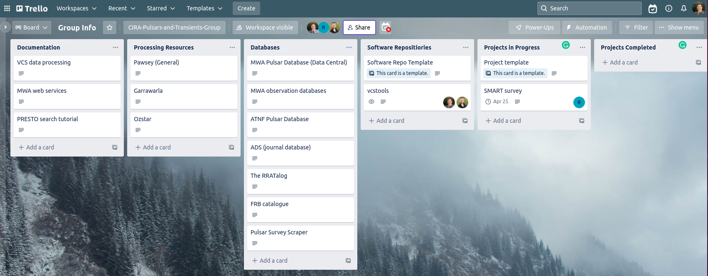
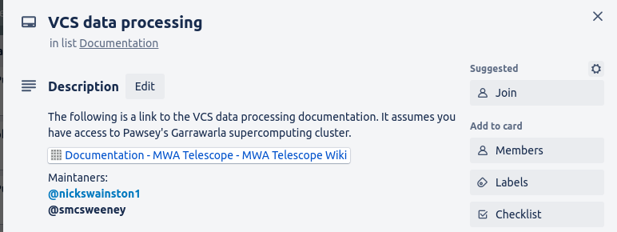

# Group Project Management
Once you become used to using project management for your own projects and tasks, you can then apply these skills to your group projects.
The key difference with group project management is that you need to discuss and agree on the plans, and have collaborative reflection times.
There will still be meetings (no avoiding them), but they should be more focused and more productive.

In this lesson we'll focus on the aspects of project management that apply to a group based project.

## Group Info Board
A typically group project will involve many people who have contributions and responsibilities that vary throughout the project.
New collaborators may join a project part way through.
In order to keep everyone on up to date about the current status of the project it is a good idea to create a meta-level board in Trello.
This "group info" board serves to direct people to the relevant documentation, documents, processing and storage resources, software requirements and repositories, as well as a list of the projects that are in progress and completed.
Note that this board doesn't act as a Kanban with tasks migrating across (except for the in progress/completed columns), but as a list of resources (mostly links) for people.
Here is an example of a Group info board:

A short description of each list is given below.

### Documentation
In the documentation list you can include links to all documentation that is useful to your group.
If your group maintains the documentation, you can note who is in charge of maintaining the documentation.

### Processing Resources
Here you can list all processing resources including super computing clusters and private servers.
You should include links to their documentation and where to submit incident tickets.

### Databases
Here you can describe all of your groups databases, where you can access them and any documentation.
You can also include other databases that your collaborators will find useful.

### Software repositories
It is best to keep repositories in your group's GitHub organization but that is not always possible, especially when your collaboration spans multiple institutions.
For this reason, listing all of repositories that your group uses is useful.
You should include the GitHub and documentations links and the maintainers.

### Projects
For each project you can create a card which includes a link to the Trello board for that project and the person leading the project.
The lead can include a summary of the project each week to update to the group on it's progress.
Once they're complete they can be moved to the completed list and links to the final project version can be included for future reference.

## Trello workspaces
As you become involved in more and more projects (hopefully still sticking to your FTE budget), you'll end up with a large number of boards that you need to keep track of.
Workspaces are a nice way to group related boards.
Even for a smaller number of projects, if you are keeping your projects on separate boards, and have a group info board, it is useful to be able to group all of these together in one place.
This is where Trello workspaces come in handy.
A Trello workspace is simply a grouping of boards.
By default, when you invite someone to join a workspace, they will have access to all the boards within.

It is possible to create a "private" board within a workspace that will only be visible to the people that you explicitly invite to that board.
These private boards can be useful for when you have a new project starting that you aren't (yet) willing to share with the group, but will eventually want to open up to the group.
It is also possible to move Trello boards between workspaces.

## Recurring tasks
Project management comes with an overhead which, though small, is not zero.
To effectively manage a project the following tasks need to be completed:
- An agreement between all interested parties on what the scope, goals, and resourcing for the project will be. This can be as a one off agreement during a kick-off meeting, but typically this is something that will need to be revisited as the scope and available resources change throughout the project.
- Creation of tasks and assignment of people to these tasks. This should include a time/resource estimate, and should coincide with the creation of a task/card in Trello.
- Closing completed or obsolete tasks. Moving completed tasks from in progress to done, and obsolete tasks into the archive (or deleting them).
- Reflecting on progress toward the project deliverables, and adjusting the timeline/resources as required. This will help defend your project against scope creep or resource starvation.
- Manage access to workspaces and boards. Closing boards for completed projects. 

It is often a good idea to assign the above responsibilities to one or more people, and have that work be recognized as part of their contribution to the project (make a task for it, assign a fraction of their time to do ti.).

## Communication
Though Trello provides an avenue for people to keep up to date on the progress of a project, it is often still beneficial to have a regular meeting schedule for work that needs to be discussed or changes need to be agreed on.
Meetings may have become the bane of your existence, however they can actually be useful if you choose an appropriate cadence, set an agenda, and then release people either at the preset meeting end or when you reach the end of the agenda.

Between regular meetings it is often a good idea to identify channels of communication that people should use for various tasks.
Low latency communication via Slack can be great for working through a software issue between 2-3 people.
Emails are best for broadcast type information sharing which require some form of permanence or traceability.

If you have a slack workspace for your project, a regular meeting time, or an email distribution list, you should include these on your group info board so that everyone knows where to go for help and what to expect.



