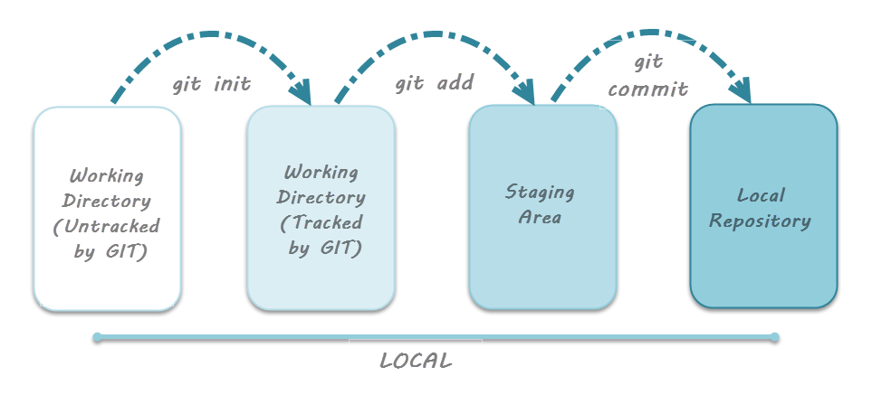
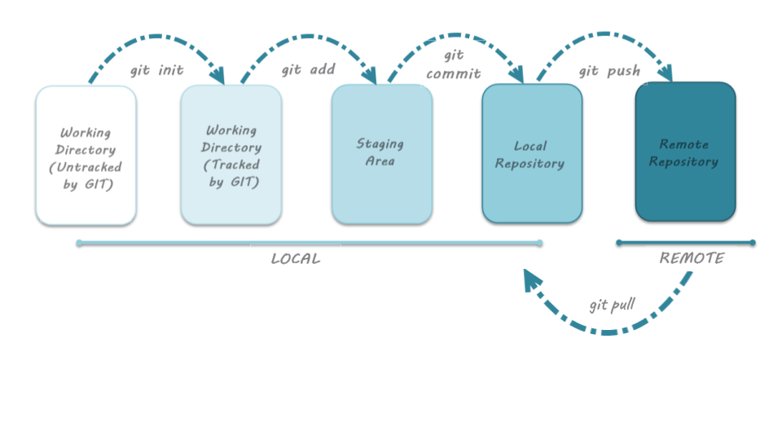
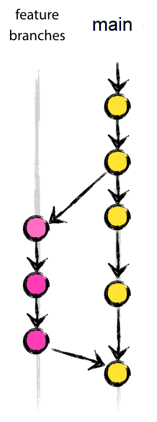
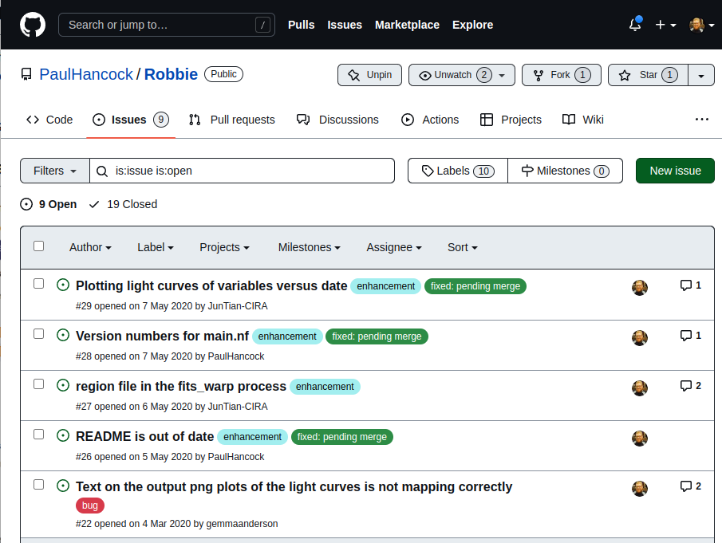
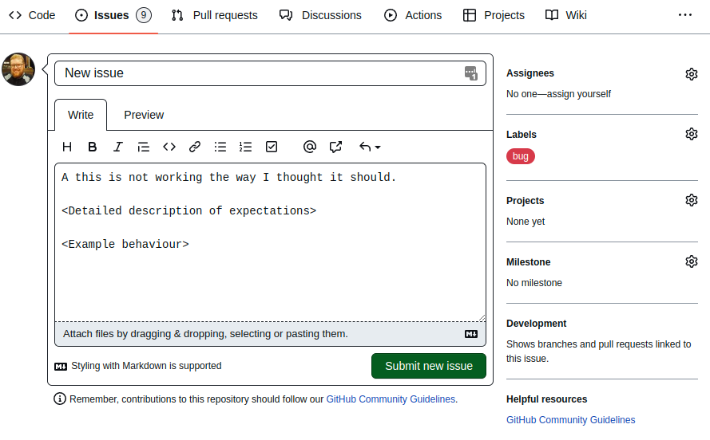
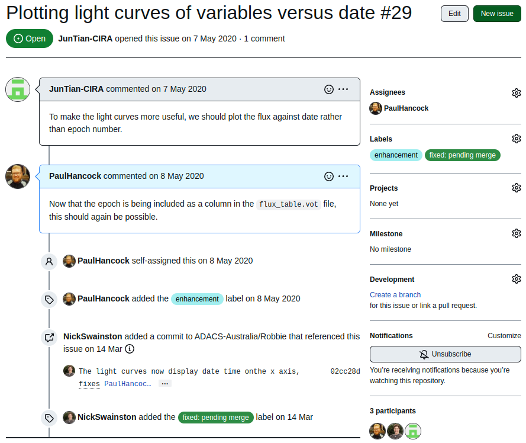
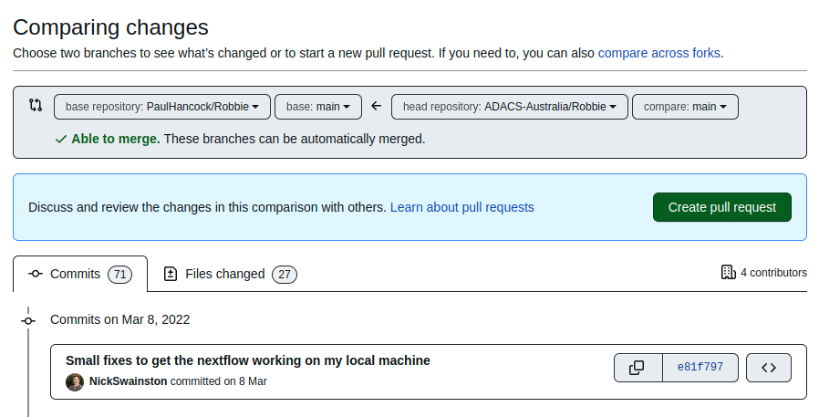
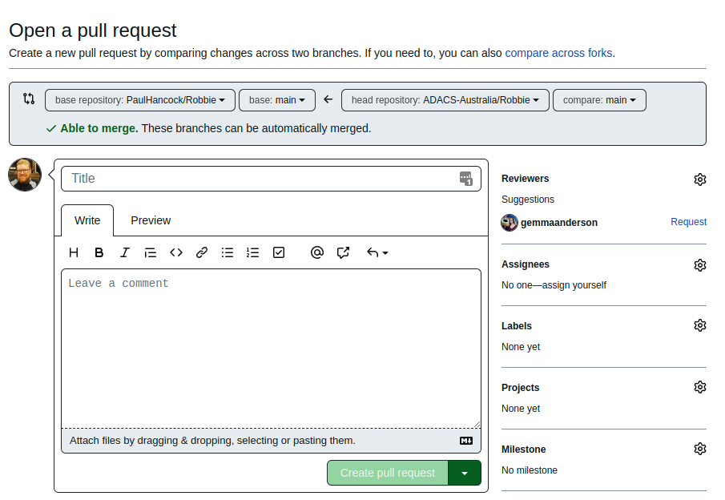

# GitHub
<!-- TODO Paul and I can fill out this section after we assess the skill of the students -->
## Recap
For this lesson we assume that you already know how to track files on your own computer and that you are comfortable with the basic git workflow:

image credit: [toolsqa](https://www.toolsqa.com/git/git-life-cycle/)

## Working With Remote Repositories

Version control really comes into its own when we begin to collaborate with other people.
Git makes collaboration easy as each party has their own complete copy of a repository and can make the required changes independently from a connection to a central repository.

In practice, however, the simplest way to work collaboratively is to use a central copy of the repository (considered to be the "truth") to which everyone adds their changes. Most programmers use hosting services like [GitHub](https://github.com), [Bitbucket](https://bitbucket.org) or [GitLab](https://gitlab.com/) to hold this central copy which is called a remote repository.

To interact with a remote repository the above workflow gets extended by a `push` and `pull` step to send and retrieve changes from the remote repo, respectively:

image credit: [toolsqa](https://www.toolsqa.com/git/git-life-cycle/)

## Working collaboratively

As mentioned above, working remotely and collaboratively is supported by various hosting services.
Everyone has their own complete copy of the entire repository and can make changes as required.
From there changes are committed (`push`ed) to a central repository and all collaborators can implement these changes in their own local repositories by running the `pull` command.

To be able to integrate one's changes in the remote repository the author will need to have write access, if they do not have these they can submit a _pull request_ or _merge request_ and a repository owner/maintainer can then approve and merge these changes.

> ## A Basic Collaborative Workflow
>
> In practice, it is good to be sure that you have an updated version of the
> repository you are collaborating on, so you should `git pull` before making
> changes. The basic collaborative workflow would be:
>
> * update your local repo with `git pull origin main`,
> * make your changes and stage them with `git add`,
> * commit your changes with `git commit -m`, and
> * upload the changes to the remote repo with `git push origin main`
>
> It is better to make many commits with smaller changes rather than
> of one commit with massive changes: small commits are easier to
> read and review.
{: .callout}

## Conflicts

As soon as people can work in parallel, they'll likely step on each other's
toes.
This will even happen with a single person: if we are working on
a piece of software on both our laptop and a server in the lab, we could make
different changes to each copy.
Version control helps us manage these
*conflicts* by giving us tools to *resolve* overlapping changes.

Sometimes the conflicts are easy to resolve and sometimes they can be down right infuriating.
As noted above, a good rule of thumb is to make many commits, and for each commit to contain a small number of changes.

> ## Reducing conflicts
> If you find yourself resolving a lot of conflicts in a project,
> consider these technical approaches to reducing them:
>
> - Pull from upstream more frequently, especially before starting new work
> - Use topic `branch`es to segregate work, merging to main when complete
> - Make smaller more atomic commits
> - Where logically appropriate, break large files into smaller ones so that it is   less likely that two authors will alter the same file simultaneously
>
> Conflicts can also be minimized with project management strategies:
>
> - Clarify who is responsible for what areas with your collaborators
> - Discuss what order tasks should be carried out in with your collaborators so
>   that tasks expected to change the same lines won't be worked on simultaneously
> - If the conflicts are stylistic churn (e.g. tabs vs. spaces), establish a
>   project convention that is governing and use code style tools (e.g.
>   [`pylint`](https://pylint.pycqa.org/en/latest/) or [`black`](https://black.readthedocs.io/en/stable/)) to enforce, if necessary
>
> Git looks at text based changes on a line by line basis.
> Therefore:
> - In a text document break your paragraphs into one sentence per line.
>   - Latex/Markdown ignore the linebreaks anyway, and it also improves human readability.
> - In a code document (script) avoid long lines where possible
>   - Many languages allow line continuation
> - When making changes, stay focused on the purpose of the change.
>   - Don't mix grammar and spelling changes with your ordering/layout changes
>   - If you use a code formatter to style your code, run it first, commit, then make the changes, run it again and commit again.
>   - Don't fix multiple bugs at once, or implement multiple features at once.
> All of the above will help you when you eventually need to roll back some of the changes that you made, or merge your changes with someone elses.
{: .callout}

## Branching

Git can store multiple concurrent sets of the changes made to the files and directories in a git repo. Each of these parallel instances is called a branch and `main` is Git's default working branch.

A new branch can be created from any commit and will have a divergent history starting from this commit. Branches can also be **merged** together.

### Why are branches useful?

Developing software we want to try out some new ideas, but we're not sure yet whether they'll work or if we'll keep them.
While this development work is going on we want to make sure that our working version of the software is unaffected.
To do this we can create a branch, e.g. 'feature1', and keep our `main` branch clean.

When we're done developing the feature and we are sure that we want to include it
in our program, we can merge the feature branch with the `main` branch.
This keeps all the work-in-progress separate from the `main` branch, which
contains tested, working code.

When we merge our feature branch with `main`, git creates a new commit which
contains merged files from `main` and `feature1`.
After the merge we can continue developing (and making commits) in `feature1` as well.
**The merged branch is not deleted.**

### Branching workflows

One popular model is the [Gitflow model](http://nvie.com/posts/a-successful-git-branching-model/):

- A `main` branch, representing a released version of the code
- A release branch, representing the beginnings of the next release - a branch
where the code is still undergoing testing
- Various feature and/or developer-specific branches representing
work-in-progress, new features, bug fixes etc

There are different possible workflows when using Git for code development.
If you want to learn more about different workflows with Git, have a look at
[this discussion](https://www.atlassian.com/git/tutorials/comparing-workflows)
on the Atlassian website.

### Branch Summary
- A branch is a divergent history from the `main` branch starting at a specific commit
  - You can think of them as pointers to a specific commit
- You should develop new code on a branch so that your `main` always remains in working order
  - branch early, and branch often
  - there is no storage / memory overhead with making many branches, it's easier to logically divide up your work than have big beefy branches which are more likely to cause merge conflicts.
- Merging creates a new commit that integrates the changes and existing branches are not changed.
- Rebasing moves your changes to the tip of the existing branch and will re-write history to give you a linear workflow. You should not do it in shared branches!

# Collaborative software development concepts

## Issue tracking
The first point of call is the issue tracker.
In my experience this is the most useful collaborative tool.
You can access the issue tracker from the "Issues" tab of a GitHab repo:
<!-- TODO: Make some GitHub versions of these following figures-->

The issues are labeled (number and description), and can have tags to categorize them.
Issues can be assigned to people, and have an inbuilt tracker / conversation associated with them.

When creating a new issue you'll see the following:

The following items can be set when creating an issue (and all can be updated later):
- Each issue needs to have a short **name**, but can have a long (very long) description.
- The more detailed the **description** of the problem/question/request is, the easier it can be for people to resolve.
It is good practice to include screen shots or some other example of the behaviour.
- You can **assign** people to work on the issue. They'll be notified when you save/update the issue.
- A set of default **labels** are provided, but you can create your own. Multiple labels can be added to an issue so you can use them for multiple purposes.
- If you have a GitHub [project](https://docs.github.com/en/issues/trying-out-the-new-projects-experience/about-projects) setup you can link to it.
- If you have defined any **milestones** you can link to that as well (not discussed here).

Below is an example task that was created by a user, and has been worked on by two developers.

Note the use of tags, and that Github can link particular commits to an issue with in a repository.

A super useful capability to note is that each issue has a unique number (6 in the image above), and that you can make links to that issue in the git commits or other issues, simply by referring to it via `#29`.
The discussion thread of each issue will then be automatically populated with a link to that commit.

## Merge/Pull requests
It is good practice to set one of your branches as THE branch which will always work.
Typically this is the `main` branch.
In GitHub you can prevent people from committing changes directly to this branch by making it a *protected* branch.
People will be unable to push changes to a protected branch, the only way to make changes is via a pull request.

A pull request is performed between different branches on a repository.
If you have fixed a bug or developed a new feature in your feature branch and want those changes to be included in the main branch then you'll create a pull request to make this happen.

To begin a pull request we click the `pull requests` tab, and select "new pull request".
You'll then need to select which branches you are going to be merging, and the direction.
In the example below we are creating a pull request between different repositories (one being a copy of the other):

Click the "Create pull request" button and you'll be taken to a familiar looking interface.

A pull request is treated as a special kind of issue so it'll get a number just like an issue would, and much of the information that is being requested is the same.
You can link to this pull request in the same way you would with an issue.
Additionally a pull request can set a reviewer - this is the person that will *identify* issues, and *approve* the merge request.
See the next section for a short discussion on code review.

Once the merge request has been created GitHub will show you which commits will be included, which files will be changed, and if there are any conflicts.
If there are conflicts that cannot be automatically resolved, you will not be able to do the merge until the conflicts are resolve and the approver has signed off (if assigned).
Behind the scenes a pull request is just doing `git merge` (or `git rebase` depending on what you choose).
If there are conflicts you'll see a note that the branches cannot be merged.
To fix this you should create and push new commits to the branch that is being pulled to resolve these conflicts.
Once there are no conflicts, you'll get a green tick, and then the option to merge the branches.

## Code review
Code review is the process of consciously and systematically checking that new or updated code is up to spec according to a set of standards.
Code review is an important phase of the development cycle for any code base, and whilst it will take time to complete, it will save you time and stress in the long term.

Before new code is accepted into the code-base a review takes place to ensure that the code meets the project standards.
Standards can include:
- existing tests still pass
- new code has accompanying tests (which pass)
- test coverage for new/changed code is at least 80%
- documentation has been updated to align with adjustments to code
- code is formatted according to project guidelines (eg, [PEP8](https://www.python.org/dev/peps/pep-0008/))

It is generally a good idea to document the standards and procedures for accepting a pull request for your code base.
The `CONTRIBUTING.md` file in the root of your repo is a good place to outline these standards/procedures.

Not only is code review good for your project, but it is good for your developers.
By frequently discussing how and why code is being written, and analyzing each other's code, you will learn new software development skills.
In general, academics are rather scared to share their "garbage code" with others, but, just like paper writing, it's only through peer review and self-reflection that you can improve your skills.

### Who performs code review?
GitHub and GitLab both provide an interface for performing code review at the pull/merge request stage.
Additionally, CI features (above) can be set up such that they will compile documentation, run tests, and report coverage, for each merge/pull request and then comment with their results.

Even with the above automated features there is usually a final requirement that someone is responsible for signing off on a set of changes.
Code review should not just be performed by one person, even if they are the senior developer.
Code review is in everyone's interest and the opportunity/responsibility should be shared.

### Forms of code review
*Discussion based* - where the code is shared among the team and input is sought.
Strengths and weaknesses are highlighted along with potential alternatives.
This work well for a small group of dedicated people.

*Pair programming* - where the review is happening during the development phase.
You and a buddy work on the same problem or same piece of code and continually share your solutions.
This is an excellent way to up-skill new members and introduce them to the procedures and standards of your project.

*Informal* - where new/changed code is discussed with a colleague over a hot-beverage at your desk.
This may break out into pair programming, or be elevated to a larger group discussion, and is thus a great place to start your code-review.

*Tool assisted* - where much of the review process is done by the computer.
Checking that tests pass and coverage quotas are met is a simple task for a computer.
Ensuring that code obeys a style guide such as PEP8 can be done by your IDE as you work.
Templates for doc-strings and new files to align with project style can also be provided to your IDE.

# Software Collaboration
The size and scope of the software will determine which project management tools will best suit your needs.

For a small project you can probably manage all the development using only GitHub issues.
However, as the project grows, or as you increase the number of people working on the project you'll find yourself looking for something like Trello to manage the higher level tasks.

Trello has the option to attach branches, commits, issues and pull requests directly to cards using the GitHub Power-Up.
<!-- TODO Put screenshots here -->

You can keep all of your internal goals and development discussion in Trello and leave GitHub issues for user suggestions and bug reports.

> ## Bonus note: Optional Issues Sync
> The following link describes how to set up a bot that will make a new card an a Trello Board each time a new Issue is created on a GitHub page.
> https://www.zzbots.com/community/how-to/sync-new-github-issues-to-trello-1-way-sync

<!-- TODO Mention GitHub Projects here -->



