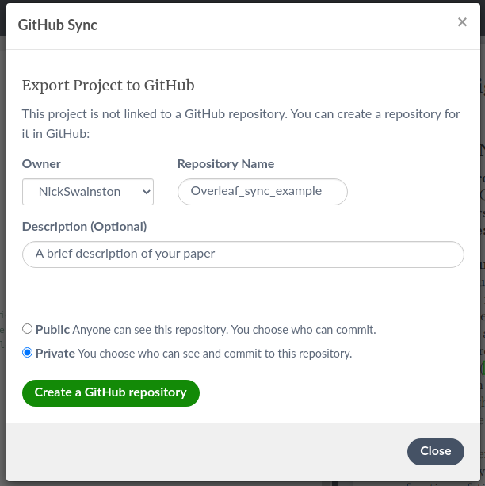

# Project Collaboration
It will be benifical to project manage any large peice of work, whether it is software, processing or analyising data. All of which may turn into a paper which you can also manage on the same Trello board.

## Project Plan
Your first metting for the project should involve planning. Filling out the [project plan template](../03-trello/#project-plan) will likely cover all the important points such as each collaborators roles and FTE commitment, the goals and where software and data will be stored.

## Recommended Trello template
The standard to do, in progress and done lists are usually sufficient but feel free to add more. The following labels will likely be helpful.

Plots, Tables, and Writing will make it more transparent what the card's task is and will make it easier to find the task you are looking for. Needs discussion is a helpful label to flag something you are unsure of so you can prioritise discussing the card in the next meeting. Processing is a useful label in case of supercomputer maintenance or outages. You will be able to see which tasks you need to prioritise before the supercomputer is down.

Here is an example of a Trello board used for developing a survey paper.

As the board gets busier, you can use filters to find important tasks. For example, the supercomputer is about to go into maintenance for a week, so I want to see all processing tasks assigned to me. I click the filter button in the top right and click "Cards assigned to me" and the Processing label.

I can now see that I have one processing task assigned to me, so I will complete it before the supercomputer is down for maintenance.

# Paper Collaboration

## Reproducible data
It is important to make all results reproducible in research. Not only is this good practice so that other researchers can use your work, it will also improve the organisation of your data. You can assure this, first plan where to store your data so it is accessible in the future. The best solution is dependent on the size of your data.

### Small data (<1 GB)
If your data is less than a GB then you can store this data on a github repository. This is the easiest solution as you can build the data into your github scripts so you can simply download the data and reproduce your results

### Medium data (<~10 GB)
If you data is has several large (100 MB to 2 GB) files you can use [git lfs](https://git-lfs.github.com/) to store large files on github without it storing the differences between the files.

### Large data (<1 TB)
This data is too large to store on most online resources so you need to decide a long term place to store it. Some options are
- on a supercomputer
- on a local hard drive
- on a cold storage service

You must then include in your GitHub's README.md instructions on where the data is, how to download the data and, if it is not available to the public, who can download it on your behalf.

### Enormous data (>1 TB)
Some data is too large to store anywhere so instead you must document how to recreate the data. This should include the observations/data location, the software required to process it and what options you used to create the data.

## Using a GitHub repo for the paper
It is common use some simple python to create some plots or format a csv into a latex table. When we start collaborating this can bit complicated if we have several versions of these scripts and we're emailing the scripts back on forth. It is better to make a new GitHub repo so it is easier to collaborate and version controlled. The goal of the repository should be that you can run all of the scripts and reproduce all plots, tables and results from your paper. Not only is this good software practice, it is also good research practice to make it easier for future researchers to recreate your work. A link to the GitHub page should be put in the Trello Boards description.

## Paper version control
Proper verson control of your paper will allow you to compare with earlier versions (if you want to revert a change) and prevents the need of keeping multiple versions. Overleaf has become hugely popular for collaborating on papers and for the following methods we will assume that is what you are using to write your latex papers. There are several methods of version control with Overleaf, the project lead should choose the method before beginning writing the paper.

### Method 1: Overleaf premium
If you, or the paper owner, has Overleaf premium, then Overleaf will keep track of changes for you. To view the history, you click the History button, and you can view all the changes you and your collaborators have made.

You can see the differences each change made with the "Compare to another version" button in the top left. For example, here is a diff where I can see myself adding an equation.

As you can see, most of the version control is automated. The only manual version control required is adding labels (the blue button on the top right in the History tab).

Once you've added a label, you can view them in the Labels section of the History tab to compare the differences between versions.

### Method 2: Github pull and push
With a free overleaf account, you can make a GitHub repository that overleaf can push and pull to. You can use this to commit changes frequently and even use the GitHub page to tag release versions (first draft, referee response, final etc.).

You can create a GitHub repository by clicking the menu in the top right of the paper's overleaf page

and then click the GitHub button under Sync

Then give your new GitHub repository a Name and description and click "Create a GitHub repository". By default, it will make a private repository, and this is usually best to ensure no one accesses your paper before publication.

All users should frequently push their changes. You can do this by clicking the menu, GitHub, and then Push.

Then write a commit message. Note that GitHub will not know which user created this commit so always include your name in the commit.

Once you have made significant progress and you would like to mark this as a specific version (first draft, referee response, final etc.), you can go to the GitHub page and make a release. You can use these releases (also known as tags) to compare versions with `git diff`
<!-- TODO add a link if Paul has a relevant section -->

## Reflect
Once the paper is published or the project is completed it is important to have a final meeting to reflect on project. Think if there are things you could improve on for future projects.



